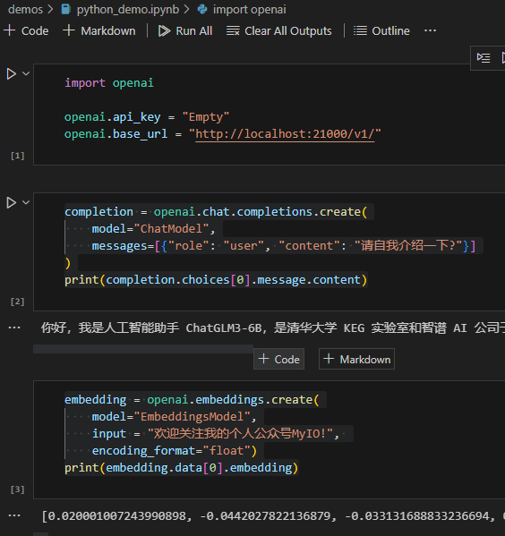

**[中文说明](README.zh-cn.md)**

Whether it's due to network access restrictions or data security reasons, we may need to deploy large language models (LLMs) privately in order to run access locally.

This project provides a quick way to build a private large language model server, which only requires a single line of commands, you can build a private large language model server locally, and provide an OpenAI-compatible interface.

*Note: This project can also be used in a CPU environment, but the speed will be slower.*

# How to use

## 1. Install dependencies

- First, make sure you have Python installed on your machine (I'm using 3.10)

- Then, install the dependencies

```bash
pip install -r requirements.txt
```

## 2. Download the model

This project is based on [FastChat](https://github.com/lm-sys/FastChat), which supports [multiple large language models](https://github.com/lm-sys/FastChat/blob/main/docs/model_support.md).

Personally, I only tested the LLM model [THUDM/ChatGLM3-6B](https://huggingface.co/THUDM/chatglm3-6b) vs. the Embedding model [BAAI/bge-large-en](https://huggingface.co/BAAI/bge-large-zh), other models can theoretically be used as well.

```bash
git lfs install
git clone https://huggingface.co/THUDM/chatglm3-6b
git clone https://huggingface.co/BAAI/bge-large-zh
```

## 3. configration

This project can deploy multiple models at the same time, just need to configure the model name and path key-value pair in`config.py`.

```python

WORK_CONFIG = {
    "host": HOST,    
    "port": 21002,
    # Model name and path key-value pairs
    "models": {
        # The name can be customized, and the path can be relative or absolute
        "ChatModel":"d:/chatglm3-6b", 
        "EmbeddingsModel":"./models/bge-large-zh", 
    },    
}
```

## 4. Start the service

```bash
python startup.py
```

When you see the following output, the service has been started successfully:

```bash

Local-LLM-Server is successfully started, please use http://127.0.0.1:21000 to access the OpenAI interface
```

# Usage examples

The sample code is stored in the `demos` directory.

## 1. python

```python
import openai

openai.api_key = "Empty"
openai.base_url = "http://localhost:21000/v1/"

# Use the LLM model
completion = openai.chat.completions.create(
    model="ChatModel",
    messages=[{"role": "user", "content": "Tell us about yourself?"}]
)
print(completion.choices[0].message.content)

# Use the Embeddings model
embedding = openai.embeddings.create(
    model="EmbeddingsModel",
    input = "Please star⭐️ this project on GitHub!", 
    encoding_format="float")
print(embedding.data[0].embedding)
```



## 2. C#

*Requires reference to Nuget Microsoft.SemanticKernel 1.0.1*

```csharp
using Microsoft.SemanticKernel;

var kernel = Kernel.CreateBuilder()
        .AddOpenAIChatCompletion(
             modelId: "ChatModel",
             apiKey: "NoKey",
             httpClient: new HttpClient(new MyHandler())
        ).Build();

var prompt = "Tell us about yourself?";
var result = await kernel.InvokePromptAsync(prompt);
var answer = result.GetValue<string>();
Console.WriteLine(answer);

//Since Microsoft.SemanticKernel does not provide a direct way to set the address of the OpenAI server,
//Therefore, you need to customize a DelegatingHandler and change the OpenAI server address to the Local-LLM-Server address.
class MyHandler : DelegatingHandler
{
    public MyHandler()
        : base(new HttpClientHandler())
    {
    }
    protected override Task<HttpResponseMessage> SendAsync(HttpRequestMessage request, CancellationToken cancellationToken)
    {
        var newUriBuilder = new UriBuilder(request.RequestUri);
        newUriBuilder.Scheme = "http";
        newUriBuilder.Host = "127.0.0.1";
        newUriBuilder.Port = 21000;

        request.RequestUri = newUriBuilder.Uri;
        return base.SendAsync(request, cancellationToken);
    }
}
```
