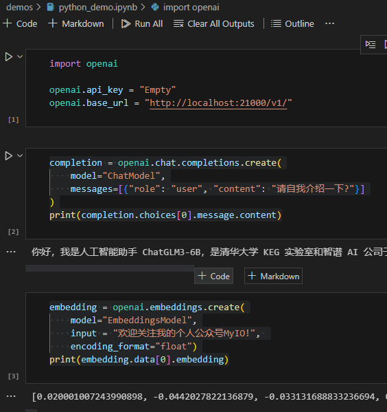

无论是由于网络访问限制，还是数据安全原因，我们可能需要私有化部署大语言模型（LLM），以便在本地运行访问。

本项目提供了一个快速搭建私有大语言模型服务器的方法，只需要一行命令，就可以在本地搭建一个私有的大语言模型服务器，并提供OpenAI兼容接口。

*注意：本项目在CPU 环境下也可以使用，但是速度会比较慢。*

# 使用方法

## 1. 安装依赖

- 首先，确保你的机器安装了 Python（我使用的是3.10）

- 然后，安装依赖

```bash
pip install -r requirements.txt
```

## 2. 下载模型

本项目基于[FastChat](https://github.com/lm-sys/FastChat)实现，FastChat支持[多种大语言模型](https://github.com/lm-sys/FastChat/blob/main/docs/model_support.md)。

我个人只测试了 LLM 模型 [THUDM/ChatGLM3-6B](https://huggingface.co/THUDM/chatglm3-6b) 与 Embedding 模型 [BAAI/bge-large-zh](https://huggingface.co/BAAI/bge-large-zh)，其他模型理论上也可以使用。

```bash
git lfs install
git clone https://huggingface.co/THUDM/chatglm3-6b
git clone https://huggingface.co/BAAI/bge-large-zh
```

## 3. 配置

本项目可以同时部署多个模型，只需要在`config.py`中配置模型名称和路径键值对即可。

```python
WORK_CONFIG = {
    "host": HOST,    
    "port": 21002,
    # 模型名称和路径键值对
    "models": {
        "ChatModel":"d:/chatglm3-6b", # 名称可以自定义，路径可以用相对路径或绝对路径
        "EmbeddingsModel":"./models/bge-large-zh", 
    },    
}
```

## 4. 启动服务

```bash
python startup.py
```

当看到如下输出时，说明服务已经启动成功：

```bash
Local-LLM-Server 启动成功，请使用 http://127.0.0.1:21000 访问 OpenAI 接口
```

# 使用示例

示例代码都存放在`demos`目录下。

## 1. python

```python

import openai

openai.api_key = "Empty"
openai.base_url = "http://localhost:21000/v1/"

# 使用 LLM 模型
completion = openai.chat.completions.create(
    model="ChatModel",
    messages=[{"role": "user", "content": "请自我介绍一下?"}]
)
print(completion.choices[0].message.content)

# 使用 Embeddings 模型
embedding = openai.embeddings.create(
    model="EmbeddingsModel",
    input = "欢迎关注我的个人公众号MyIO!", 
    encoding_format="float")
print(embedding.data[0].embedding)

```



## 2. C#

*需引用 Nuget Microsoft.SemanticKernel 1.0.1*

```csharp

using Microsoft.SemanticKernel;

var kernel = Kernel.CreateBuilder()
        .AddOpenAIChatCompletion(
             modelId: "ChatModel",
             apiKey: "NoKey",
             httpClient: new HttpClient(new MyHandler())
        ).Build();

var prompt = "请自我介绍一下?";
var result = await kernel.InvokePromptAsync(prompt);
var answer = result.GetValue<string>();
Console.WriteLine(answer);

//由于 Microsoft.SemanticKernel 没提供直接设置 OpenAI 服务器地址的方法，
//所以需要自定义一个 DelegatingHandler，将 OpenAI 服务器地址修改为 Local-LLM-Server 地址。
class MyHandler : DelegatingHandler
{
    public MyHandler()
        : base(new HttpClientHandler())
    {
    }
    protected override Task<HttpResponseMessage> SendAsync(HttpRequestMessage request, CancellationToken cancellationToken)
    {
        var newUriBuilder = new UriBuilder(request.RequestUri);
        newUriBuilder.Scheme = "http";
        newUriBuilder.Host = "127.0.0.1";
        newUriBuilder.Port = 21000;

        request.RequestUri = newUriBuilder.Uri;
        return base.SendAsync(request, cancellationToken);
    }
}
```

# 欢迎关注我的个人公众号MyIO

